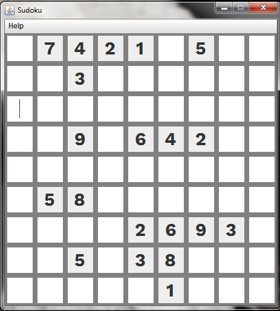

## Sudoku Game 

This project implements a classic Sudoku game using Java Swing and JTextFields. Players can enter numbers (1-9) in the grid, and the game validates the entries.The program auto saves the current game everytime you close the program or go back to the menu in case you need to leave and resume later.

**Features:**

* Traditional 9x9 Sudoku grid with JTextFields for user input
* Input validation to ensure numbers between 1 and 9 are entered
* Game state saving and loading functionality

